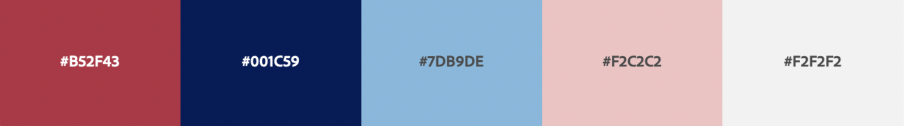
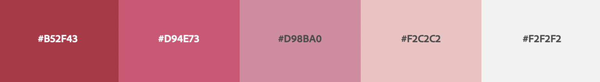

# ランディングページを作るまで

## フェーズ1/2
- フェーズ1
	- いち早くコミュニティの実在性を公開する場所を作る。
	- 最小限のコンテンツとする
	- 英語版は用意できればする。（CoinGecko等の外部サービスの審査を気にしたい）
- フェーズ2
	- コミュニティのアイデンティティを備えること。
	- メンテナンス性を上げ、コミュニティメンバーがコントリビュートするハードルを下げる。

## 1. テーマ

- フェーズ1　Hugo
	- [Universal](https://themes.gohugo.io/themes/hugo-universal-theme/)
	- [Meghna Hugo](https://themes.gohugo.io/themes/meghna-hugo/)
	- [Hero](https://themes.gohugo.io/themes/hugo-hero-theme/)
	- [Raditian Free Hugo Theme](https://themes.gohugo.io/themes/raditian-free-hugo-theme/)
- フェーズ2　Hugo, Gatsby, Next.js あたり
	- 同じテーマに拘らず、上記の目的に合致することを重視する

## 2. サイト構成

### メインコンテンツ

1. What is DFGC
2. Feature 3〜6個
3. Products　※Yamato以外はsoonでも。
- エコシステム（Ethereum, Curve, Chainlink, Gitcoin, Gitbook等の協力者アイコン）
- Team or コントリビュータ（無しでも）
- Testimonials  ニュース引用やTwitterの声（無しでも）
- 連絡先（フッター）
	- Discord
	- Twitter
	- フォーム　→メールを飛ばしてIFTTTからDiscordの問合せ部屋に（非公開にするか）

### サブコンテンツ
4. Governance
	- Gov Forum ↗️dev.
	- 投票ページ ↗️vote.
	- TXJP　目的、アロケーション ↗️Docsにする？
5. Developer
	- Github　→どのリポジトリのどのREADMEを見せたい？　↗️Github
	- 開発者用ドキュメント　↗️Docs
	- ホワイトペーパー　※Yamatoなら要る程度。
	- 募集　↗️
		- Solidityエンジニア
		- Web3 フロントエンドエンジニア
		- など
- FAQ　↗️Docsがいい？
- ブランドアセット　↗️GithubかDocs
	- ロゴ以外はリンクだけ置いて追加削除に耐えられるように。

#### News（ないなら無し）
- メディアで取り上げられたニュース
- コミュニティが対外的に発信したブログへのリンク

## 3. ブランドアセット

### 3-1. 画像
形式：png, svg
カラー：Black, ブランド色

1. favicon 16x16, 32x32
2. Appアイコン 64x64, 256x256
3. 加工用　640x640（それ以上でも）
4. lockup　800x250目安　→ロゴと名前を組み合わせた画像
5. バナー 1500x500
6. ほか

### 3-2. ブランドカラー
- メインは紅。HEXコード #B52F43 ・・・で合ってる？
- パレット

（例）

#B52F43 紅(RUST EFFECT)　
#001C59 CLARINET　
#7DB9DE 勿忘草(COASTAL WATERS)　
#F2C2C2 CHANNEL 
#F2F2F2 Bleached Silk 

（例）

## 4. コピー

詳しくはサンプルサイトを見ながら。
	1. What is DFGC　スローガン、コミュニティ説明とも
	2. Feature 3〜6個　タイトル、説明
		1. Dapps開発＆ローンチ
		2. ガバナンス
		3. コミュニティサポート
		4. など
	3. Productsの説明
		1. Yamato
		2. Yorozu(仮)
		3. soon..

## 5. Contact

